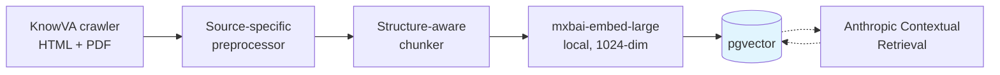
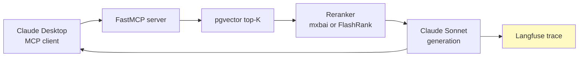

# Enterprise Internal Knowledge Base — Production-Ready RAG + MCP

A public Retrieval-Augmented Generation pipeline exposed as an MCP server. Sample content from Veterans Affairs education manuals.

The repo implements evaluation, observability, and structure-aware ingestion. Cost/latency tuning, tenant-level access control, and other production concerns are discussed in the article linked below.

**📖 Full writeup on Medium:** *link will land here upon publication*

---

## Why this exists

RAG demos tend to focus on the quality of the retrieval pipeline, without recognizing that production RAG fails on the next ten steps: prompt or model changes that pass code review but tank answer quality, cost and latency drift that cannot be traced to specific queries, cross-tenant leakage that only surfaces in audit. This repo shows what catching them looks like in practice.

The corpus is public (VA Education manuals — 238 documents, 9,000+ chunks) so anyone can clone, run, and adapt the pipeline.

---

## Quickstart

```bash
git clone https://github.com/kimsb2429/internal-knowledge-base
cd internal-knowledge-base

# 1. Start Postgres + pgvector
docker compose up -d

# 2. Python env + dependencies
python3 -m venv .venv && source .venv/bin/activate
pip install -r requirements.txt

# 3. Restore corpus fixture (~2 min — 238 docs + 9k chunks pre-embedded)
docker exec -i ikb_pgvector pg_restore -U ikb -d ikb < evals/fixture_v1.dump

# 4. Smoke-test the MCP server
python scripts/test_mcp_server.py     # 7/7 tests pass

# 5. Start the MCP server (stdio transport)
python scripts/mcp_server.py
```

### Consuming from Claude Desktop

Add to `~/Library/Application Support/Claude/claude_desktop_config.json`:

```json
{
  "mcpServers": {
    "ikb": {
      "command": "python",
      "args": ["/absolute/path/to/internal-knowledge-base/scripts/mcp_server.py"]
    }
  }
}
```

Then ask Claude things like *"What RPO handles GI Bill claims in Texas?"* — the MCP server returns ranked chunks with citations.

---

## Architecture

**Ingestion (one-time per corpus):**



**Query (per MCP tool call):**



**Stack:**
- **Vector store:** Postgres + pgvector (Docker, port 5433); `content_tsv` GIN index for hybrid-ready
- **Embeddings:** mxbai-embed-large (1024 dims, local via sentence-transformers) — $0 API cost
- **Reranker:** mxbai-rerank-base-v2 (full eval) / FlashRank MiniLM (CI fast mode, 22M ONNX, ~2s/query)
- **Generation:** Claude Sonnet
- **MCP server:** FastMCP 3.2.4 — Tools (`query`), Resources (`document://{source_id}`), Prompts (`cite_from_chunks`)
- **Observability:** Langfuse Cloud, per-trace public sharing
- **Eval:** DeepEval + 110-query golden set + GitHub Actions merge gate

---

## Eval scores

Full 110-question golden set, contextualized chunks + reranker:

| Metric | Score |
|---|---|
| Faithfulness | 0.95 |
| Answer Relevance | 0.91 |
| Context Precision | 0.61 |
| Context Recall | 0.52 |
| Context Relevance | 0.56 |

🔗 **[Live Langfuse trace](https://us.cloud.langfuse.com/project/cmo0wah7a00pfad071nk6x84c/traces/a574193bbff7d5438f7fae9e27f4bb83)** (public, no login).

**Notable result:** Anthropic's Contextual Retrieval pattern produced modest lift on top of reranking (+4.8pp AnsRel, +4.1pp CtxPrec) at this scale — well short of the +35% recall their published numbers suggested. Reported as found; juiced numbers would defeat the point.

---

## Eval-in-CI as a merge gate

Every PR runs the golden set in fast mode (FlashRank reranker, ~3-4 min wall, $0.30 in Sonnet calls) against a fixture DB. PRs that regress more than ±5pp on top1/topk/keyword_recall, or +10pp on `idk_rate`, are blocked.

**Forever-artifact:** [PR #5](https://github.com/kimsb2429/internal-knowledge-base/pull/5) — a deliberate failing-then-passing PR. Red CI catches a 20pp top1 regression; green CI confirms the fix. The Actions tab is the proof.

Workflow: [`.github/workflows/eval-gate.yml`](.github/workflows/eval-gate.yml).

---

## What this repo doesn't cover

A few production-shape items are seams, not implementations:

- **Multi-tenant scoping** — `auth_context` parameter present on every MCP tool, typed, currently unused (labels the SSO/ACL seam)
- **Ingestion concurrency** — single-threaded chunker + embedder; production would use a modulus-distributed worker pool
- **Hybrid search wiring** — `content_tsv` GIN index is live; BM25 + RRF fusion at query time stays a post-launch addition

The writeup linked above covers these topics.

---

## Repo layout

```
docs/                    Research, evidence base, deep-dives
data/                    Crawled corpus + golden query set
scripts/
  crawl_knowva.py            eGain v11 API crawler
  enrich_metadata.py         Headings, ACL, authority tier, content_category
  knowva_preprocess.py       Source-specific HTML normalization
  chunk_documents.py         Structure-aware splitter (preserves table colspan/rowspan)
  embed_and_store.py         mxbai-embed-large → pgvector
  contextualize_chunks.py    Anthropic Batches API for Contextual Retrieval
  rerank.py                  mxbai-rerank + FlashRank
  retrieve.py / generate.py  RAG path
  mcp_server.py              FastMCP exposure
  run_eval.py / score_eval.py / check_regression.py   Eval harness + CI gate
evals/                   Fixture DB dump + baseline JSON
.github/workflows/       eval-gate.yml — merge-gate workflow
```

---

## Reproducing from raw corpus (~30 min)

Each script is idempotent and resume-safe.

```bash
python scripts/crawl_knowva.py            # Crawl raw HTML (skip if data/knowva_manuals/articles/ exists)
python scripts/enrich_metadata.py         # Add headings, ACL, authority tier
python scripts/knowva_preprocess.py       # Normalize HTML quirks
python scripts/chunk_documents.py         # Structure-aware split
python scripts/embed_and_store.py         # mxbai → pgvector
python scripts/contextualize_chunks.py    # Anthropic Batches API (~$12, optional but recommended)
```

Then `python scripts/run_eval.py --fast` to verify the eval baseline reproduces.

---

## Further reading

- **Full demo writeup**: *(Medium link coming after publication)*
- [`docs/2026-04-11-engineering-rag-evidence-and-howtos.md`](docs/2026-04-11-engineering-rag-evidence-and-howtos.md) — engineering analysis, evidence base, Zero-to-MCP plan
- [`docs/2026-04-12-rag-pipeline-buy-vs-build.md`](docs/2026-04-12-rag-pipeline-buy-vs-build.md) — buy-vs-build map per pipeline stage
- [`docs/deep-dive/2026-04-16-docs-vs-code-rag-adjudication.md`](docs/deep-dive/2026-04-16-docs-vs-code-rag-adjudication.md) — when unified RAG stops working

---

## License

MIT — see [LICENSE](LICENSE).
